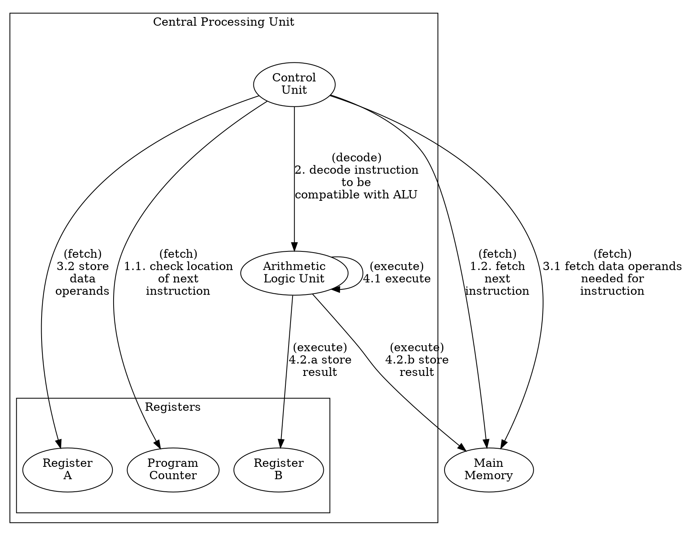

# Assignment 1 - COSC 502

## Jonathan Llovet - 2026-02-15

Here is a link to the chat I had with Claude for some of the information below. I worked with Claude on putting together commands and retrieving specifications for Question 1, and I used it to retrieve information and generate summaries for Questions 5 and 6. https://claude.ai/share/3581b639-1837-4b86-9f19-f5860c4a3eb2

## 1. Choose a computer such as your laptop and list the system configuration including:

- CPU (model, clock speed, etc.)
- Main Memory (type, size, access time, etc.)
- Cache memory (type, size, access time, etc.)
- Available ports such as HDMI, type C, etc.
- Network interface (wired/wireless) along with applicable standard such as IEEE
- Monitor (size, resolution, etc.)
- GPU

For this information, please see the appendix, where I have included the information from system_info.txt.

- WPA2 was originally developed by the WiFi Alliance. It is now maintained by IEEE (IEEE 802.11i). Source: https://en.wikipedia.org/wiki/Wi-Fi_Protected_Access
- The IPv4 protocol was developed in association with DARPA. It is maintained by the IETF. Sources: https://en.wikipedia.org/wiki/IPv4, https://www.ietf.org/rfc/rfc791.txt
- IPv6 is similarly maintained by the IETF. Sources: https://en.wikipedia.org/wiki/IPv6, https://datatracker.ietf.org/doc/html/rfc8200
- DHCP is maintained by the IETF. Source: https://www.ietf.org/rfc/rfc2131.txt
- Ethernet is maintained by the IETF. https://datatracker.ietf.org/doc/html/rfc894
- DNS is maintained by the IETF. https://datatracker.ietf.org/doc/html/rfc1035

## 2. List at least five standards used in a laptop along with brief explanations such as functionality and standard body (e.g. IEEE).

### Bluetooth Standard

Bluetooth allows devices in physical proximity to each other to communicate wirelessly. This was originally formalized by IEEE 802.15.1, but IEEE no longer maintains it. The Bluetooth standard is now maintained by the Bluetooth Special Interest Group (SIG).

Source: https://en.wikipedia.org/wiki/Bluetooth

### USB 2.0 Standard

The USB standards allow for devices to be plugged in while a machine is running through a standardized interface. These external devices can be used for data storage, retrieval, and for more sophisticated use cases like booting operating systems that are stored on the USB device. The USB standards have a complex history. They are maintained by USB Implementers Forum, Inc.

Sources: https://www.usb.org/about, https://en.wikipedia.org/wiki/USB

### Keyboard Layouts Standards (ISO/IEC 9995-1:2026(en))

This defines a framework for the layout of alphanumeric and numeric keyboards in contemporary and near-future keyboards. This is maintained by the ISO.

Sources: https://www.iso.org/obp/ui/es/#iso:std:iso-iec:9995:-1:ed-4:v1:en, https://en.wikipedia.org/wiki/Keyboard_layout

### IPv4

The Internet Protocol version 4 defines the ways in which the majority of internet traffic is conducted. From the original spec: "The Internet Protocol is designed for use in interconnected systems of packet-switched computer communication networks. The internet protocol provides for transmitting blocks of data called datagrams from sources to destinations, where sources and destinations are hosts identified by fixed length addresses.  The internet protocol also provides for fragmentation and reassembly of long datagrams, if necessary, for transmission through 'small packet' networks." The IPv4 protocol was developed in association with DARPA. It is maintained by the IETF.

Sources: https://en.wikipedia.org/wiki/IPv4, https://www.ietf.org/rfc/rfc791.txt

### DHCP (RFC 2131)

From the RFC: "The Dynamic Host Configuration Protocol (DHCP) provides configuration parameters to Internet hosts.  DHCP consists of two components: a protocol for delivering host-specific configuration parameters from a DHCP server to a host and a mechanism for allocation of network addresses to hosts." The DHCP is maintained by the IETF.

Source: https://www.ietf.org/rfc/rfc2131.txt

## 3. List at least three services for each cloud service in cloud computing – SaaS, PaaS, and IaaS – and explain the purposes and the service provider.

### SaaS

- Gmail: Popular email service that provides simple, unified email service for free, with many integration options and ability to expand storage tiers. Offered by Google.
- Okta: Security platform predominantly serving as an identity provider for single sign on and multi-factor authentication. Used widely in enterprise contexts, with developer-oriented features offered through Auth0. Offered by Okta.
- Workday: Large HR and finance platform with many sub-components for pay management, performance reviews, leave of absence, etc. Offered by Workday.

### PaaS

- AWS RDS: Relational Database Service provides fully managed databases of different types according to specifications selected by customers. Allows for provisioning a remote-accessible database with specified amount of storage and running on Postgres, MariaDB, MySQL, etc. Offered by AWS.
- Neo4j Cloud: Fully managed graph database service that allows customers to provision a remote-accessible Neo4j graph database according to provided specifications. Offered by Neo4j.
- AWS WAF: Fully managed level-7 firewall that provides intelligent filtering of traffic to an application to intelligently protect against attacks. Helps prevent not only DDoS style attacks but additionally filters out malicious payloads. Provided by AWS.

### IaaS

- AWS S3: Simple Storage Service provides managed file storage through a standardized REST interface, abstracting away concerns about disks, replication, and other availability concerns. Used for a wide variety of storage options, from logs to static assets to website hosting. Offered by AWS.
- AWS EC2: Elastic Compute Cloud offers on-demand provisioned virtual machines on a variety of operating systems based on customer specifications. Users can specify disk storage, memory, networking, and other configurations of the machines. Offered by AWS.
- AWS EBS: Elastic Block Store offers on-demand disk storage that can be associated with compute instances, such as EC2 instances. Customers can specify the type of disk that is used for the underlying storage, along with size, I/O speed, etc.

## 4. Explain fetch-decode-execute cycle in your own words – what each process does - using the involved components in the von Neumann model (use diagrams and corresponding description for your answer).

The fetch-decode-execute cycle proceeds as follows:
- The control unit checks the program counter in one of the registers for the location of the next instruction
- The control unit then fetches the instruction from main memory based on that location
- From there, the control unit decodes that instruction into a format compatible with the ALU
- The control unit additionally retrieves any data operands required for the execution of the intstruction from main memory and stores them in registers
- The arithmetic logic unit executes the instruction
- The arithmetic logic unit stores the result of the operation in a register or in main memory

## 5. List at least 5 processors including CPU and GPU and explain the following:

- Processor:
  - Role (when to use, what are they good at)
  - Application area (who need what)
  - Relationship with AI
  - At least one model/make

Note: The following is a summary response provided by Claude:

### 1. CPU (Central Processing Unit)

Role: The general-purpose processor that handles sequential, logic-heavy tasks. CPUs excel at low-latency operations with complex branching and control flow — operating systems, application logic, database queries, and single-threaded workloads.

Application Area: Universal — every computing device from laptops to servers needs a CPU. Software developers, system administrators, database engineers, and general consumers all depend on CPUs as the primary execution engine.

Relationship with AI: CPUs handle AI inference for smaller models and preprocessing/data pipeline tasks. They're used for training when datasets are small or when frameworks lack GPU support. However, they're far slower than GPUs or dedicated AI accelerators for large-scale neural network training due to limited parallelism.

Model: Intel Core i9-14900K, AMD Ryzen 9 7950X, Apple M2

### 2. GPU (Graphics Processing Unit)

Role: Designed for massively parallel computation. GPUs contain thousands of smaller cores that execute the same operation across large data arrays simultaneously (SIMD/SIMT). Originally built for rendering graphics (vertex/pixel shading, rasterization), they've become the dominant platform for parallel scientific computing and AI.

Application Area: Game developers, 3D artists, video editors, and visual effects studios rely on GPUs for rendering. Scientific researchers use them for molecular simulations and fluid dynamics. AI/ML engineers use them heavily for training deep neural networks.

Relationship with AI: GPUs are the workhorse of modern AI. Matrix multiplications — the core operation in neural networks — map perfectly onto GPU architectures. NVIDIA's CUDA ecosystem dominates AI training and inference. Nearly all large language models (including the one you're talking to) were trained on GPU clusters.

Model: NVIDIA H100, NVIDIA RTX 4090, AMD Radeon RX 7900 XTX

### 3. TPU (Tensor Processing Unit)
Role: A domain-specific ASIC designed by Google specifically to accelerate tensor (matrix) operations used in machine learning. TPUs are optimized for high-throughput, lower-precision arithmetic (e.g., bfloat16, int8) and are built around a systolic array architecture that streams data through a grid of multiply-accumulate units without needing to access memory for every operation.
Application Area: Machine learning researchers and engineers, particularly those working within Google Cloud. Used for training and serving large-scale models like Google's own LLMs, translation systems, and recommendation engines.
Relationship with AI: TPUs are purpose-built for AI. Google designed them because general-purpose GPUs were insufficient for the scale of inference their services required. They provide higher performance-per-watt for ML workloads compared to GPUs in many scenarios, though they're less flexible for non-ML computation.
Model: Google TPU v5e, Google TPU v4

### 4. FPGA (Field-Programmable Gate Array)

Role: A reconfigurable hardware chip whose logic circuits can be programmed after manufacturing. FPGAs sit between the flexibility of software (CPU) and the performance of custom hardware (ASIC). They excel at low-latency, pipelined data processing where the workload is well-defined but may need to change over time.

Application Area: Telecommunications (5G signal processing), financial trading (ultra-low-latency order execution), aerospace and defense (radar, signal intelligence), hardware prototyping, and network infrastructure (smart NICs, packet inspection). Engineers in these fields need deterministic, real-time performance without the cost of fabricating a custom chip.

Relationship with AI: FPGAs are used for AI inference at the edge where latency and power efficiency matter more than raw throughput — think autonomous vehicles, IoT devices, and data center network acceleration. Microsoft's Project Brainwave used FPGAs for real-time AI inference in Azure. They can be reprogrammed as model architectures evolve, unlike fixed ASICs.

Model: Intel/Altera Stratix 10, AMD/Xilinx Versal AI Core

### 5. NPU (Neural Processing Unit)

Role: A specialized accelerator integrated into consumer SoCs (system-on-chip) to handle AI and machine learning inference tasks locally on-device. NPUs are optimized for operations like convolutions and matrix multiplies at very low power, enabling always-on AI features without draining the battery or requiring cloud connectivity.

Application Area: Smartphone and laptop users benefit from NPUs through features like real-time photo enhancement, voice recognition (Siri, Google Assistant), background noise cancellation, object detection in camera apps, and on-device language translation. Developers building apps with Core ML or Android NNAPI leverage NPUs automatically.

Relationship with AI: NPUs bring AI inference directly to the edge device, reducing latency and preserving privacy since data doesn't need to leave the device. They're central to the "AI PC" and "AI smartphone" trends. Apple's Neural Engine in your M2 chip, for instance, performs 15.8 trillion operations per second and powers features like Live Text, Visual Lookup, and on-device dictation.

Model: Apple Neural Engine (M2/A17 Pro), Qualcomm Hexagon (Snapdragon 8 Gen 3), Intel AI Boost (Meteor Lake NPU)

## 6. List at least 5 memory types and explain the following:
- What it is
- When to use (purpose - what are they good at)

Note: The following is a summary response provided by Claude:

### 1. SRAM (Static Random-Access Memory)

What it is: SRAM stores each bit using a flip-flop circuit made of typically six transistors. It doesn't need to be periodically refreshed like DRAM — the data persists as long as power is supplied. This makes it extremely fast but also expensive and physically large per bit, which limits its capacity.

When to use: SRAM is used for CPU cache memory (L1, L2, L3) where speed is critical and only small amounts of storage are needed. On your M2, the L1 data cache is 128 KB of SRAM with ~0.86 ns access time. It's also used in register files, TLB caches, and embedded systems where deterministic, low-latency access is essential.

### 2. DRAM (Dynamic Random-Access Memory)

What it is: DRAM stores each bit as a charge in a tiny capacitor paired with a single transistor. Because capacitors leak charge, DRAM must be refreshed thousands of times per second, hence "dynamic." This simpler cell design (1 transistor + 1 capacitor vs. SRAM's 6 transistors) allows much higher density and lower cost per bit, but at the expense of speed.

When to use: DRAM is used as main memory (RAM) in virtually every computing device. It serves as the primary working memory where the OS, running applications, and active data reside. Your M2 uses LPDDR5 SDRAM — a synchronous, low-power variant — providing 8–24 GB of unified memory at ~100 ns access latency. It bridges the gap between ultra-fast but tiny caches and large but slow storage.

### 3. Flash Memory (NAND)

What it is: Flash is a type of non-volatile memory that stores data by trapping electrons in floating-gate or charge-trap transistors. Data persists without power. NAND flash is organized in pages and blocks — you read/write at the page level but must erase entire blocks at once. Variants include SLC (1 bit/cell, fastest, most durable), MLC (2 bits), TLC (3 bits), and QLC (4 bits, densest but slowest).

When to use: Flash is the basis of SSDs, USB drives, and SD cards. It's used for persistent storage where speed matters more than what traditional hard drives offer. Your MacBook Pro's internal SSD uses NAND flash, delivering read speeds of several GB/s via the NVMe protocol — orders of magnitude faster than a spinning disk, though still far slower than DRAM (~100 µs vs. ~100 ns).

### 4. HDD (Magnetic Disk Storage)

What it is: Hard disk drives store data as magnetic orientations on spinning platters coated with a thin ferromagnetic layer. A read/write head on a mechanical arm moves across the platter to access data. Because it involves physical motion (seek time + rotational latency), access times are measured in milliseconds — roughly 100,000× slower than DRAM.

When to use: HDDs are used for bulk storage where cost per gigabyte matters most and access speed is less critical — file servers, NAS devices, backup systems, data archives, and surveillance recording. At roughly 2–3 cents per GB compared to 8–10 cents for SSD, HDDs remain the economical choice for storing terabytes of cold or infrequently accessed data.

### 5. ROM (Read-Only Memory)

What it is: ROM is non-volatile memory whose contents are written once (during manufacturing or via a special programming process) and are either permanent or very rarely modified. Variants include mask ROM (fixed at fabrication), PROM (one-time programmable), EPROM (erasable via UV light), and EEPROM (electrically erasable, the ancestor of flash). The contents survive power loss indefinitely.

When to use: ROM stores firmware and bootstrap code — the low-level instructions a device needs to start up before it can access any other storage. The BIOS/UEFI on a PC, the boot ROM on your M2 (which initializes the secure boot chain), and embedded microcontroller firmware all live in ROM or its modern descendants (EEPROM/flash used in a ROM-like role). It's essential anywhere you need guaranteed, tamper-resistant code that's available the instant power is applied.

# Appendix

